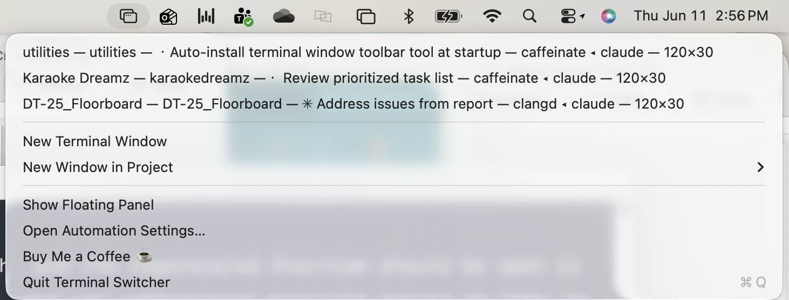

<!-- Copyright (c) 2025-2026 Greg Ames/Ames & Associates. Licensed under the Coffee Right License — see LICENSE. -->
<!-- Project: Terminal Switcher | Filename: README.md -->
# Terminal Switcher

A lightweight macOS menu-bar app that lists every open Apple Terminal window — labeled by project — and jumps to any of them in one click.



**Like it? [Buy me a coffee ☕](https://buymeacoffee.com/terminalswitcher)**

Terminal Switcher is distributed as a free binary under the Coffee Right License.

## Features

- Menu-bar dropdown listing all open Apple Terminal windows.
- Click (or drag and release) on a window to bring it to the front.
- A persistent, auto-sizing floating panel of windows you can keep on screen.
- Project names resolved automatically from each window's working directory.
- **New Terminal Window** to open a fresh shell.
- **New Window in Project ▸** submenu that opens a shell in any project under
  your chosen Projects Folder.
- Fast and snappy — window info is cached and refreshed in the background, so
  the menu opens instantly.
- **Start at Login** toggle — one click and it is simply *always there*.
- **Check for Updates** — manual, one-click self-update from the About panel.
- Deliberately small: a single universal binary, no Dock icon, negligible
  memory footprint, and no network activity — except when you click
  **Check for Updates**.

## Why I Built It

I use Claude Code every day, all day — and almost never on just one project. At
any given moment I have four, five, six Terminal windows open, each one running
a Claude Code session in a different project: one fixing a bug in a web app,
one processing documents, one doing infrastructure work.

The problem: **those windows all look identical.** Finding the right one meant
going down to the Dock, clicking and holding (or Option-clicking) the Terminal
icon, squinting at a list of near-identical window titles, picking one,
realizing it was the wrong one, and going back to do it again. Dozens of times
a day. It was cumbersome, it broke my concentration, and the time lost added up.

What I actually wanted to know at a glance was simple:

1. *Which project is each window in?*
2. *What is each session working on right now?*

So Terminal Switcher answers exactly those two questions, from a menu that is
always in the same place at the top of the screen. One click to see everything,
one click to be in the right window. It turned a recurring daily annoyance into
a non-event — and if you run multiple terminal sessions for any reason (Claude
Code or otherwise), it will likely do the same for you.

## Install

### Option 1 — Quick install (any Mac — Intel or Apple Silicon)

```bash
curl -fsSL https://raw.githubusercontent.com/searayca/terminal-switcher/main/install.sh | bash
```

Works on both Intel and Apple Silicon Macs — it installs the prebuilt
universal app from the latest release, no Homebrew or Xcode needed.

### Option 2 — Homebrew

```bash
brew install searayca/tap/terminal-switcher
```

Then follow the caveats Homebrew prints to copy the app into `~/Applications`
and launch it.

### Option 3 — Download

Grab `Terminal-Switcher-vX.Y.Z-universal.zip` from the
[Releases page](https://github.com/searayca/terminal-switcher/releases),
unzip it, and move `Terminal Switcher.app` to `~/Applications`. The
release zip is a universal binary (Intel + Apple Silicon).

> **Gatekeeper note:** the app is **not notarized**, so macOS will block a
> normal double-click launch of a manually downloaded copy.
> **Right-click (or Control-click) the app → Open → Open** the first time;
> after that it launches normally. Installing via the quick-install one-liner
> or Homebrew avoids this entirely.

## First launch

The first time Terminal Switcher tries to list or switch windows, macOS will
prompt:

> **"Terminal Switcher" wants access to control "Terminal".**

This is the standard macOS **Automation** permission — the app drives
Terminal via Apple Events to enumerate windows and bring the one you pick to
the front. **You must click "Allow"** or the app cannot function.

If you declined the prompt (or want to change it later), re-enable it in
**System Settings → Privacy & Security → Automation → Terminal Switcher →
Terminal**. The app's menu also has **Open Automation Settings…** to jump
straight there.

## Usage

Click the 🖥️ icon in the menu bar to open the dropdown. Release the click on a
window row to switch to that window. The dropdown also includes:

- **New Terminal Window** — open a fresh shell.
- **New Window in Project ▸** — open a shell in any project under your
  Projects Folder (see below).
- **Show Floating Panel** — show the persistent floating window list.
- **Set Projects Folder…** — choose the folder that contains your projects.
- **Start at Login** — toggle launching the app automatically at login.
- **Open Automation Settings…** — jump to the macOS Automation privacy pane.
- **About Terminal Switcher** — version info, links, and Check for Updates.
- **Check for Updates…** — manually check GitHub for a newer release.
- **Quit Terminal Switcher**.

Note: the app drives Apple `Terminal.app` only; it does not support iTerm or
other terminal emulators.

## Floating Panel

For heavy switching sessions, **Show Floating Panel** opens an always-on-top
window listing the same Terminal windows as the dropdown — but it stays on
screen, so you can hop between sessions with single clicks instead of opening
the menu each time. The panel sizes itself to its list, refreshes live as
windows open, close, and change directory, stays put without stealing focus
from your terminal, and remembers its position between launches. Close it with
its close button; reopen it from the menu any time.

## Where the app lives

Terminal Switcher is a **menu-bar-only** app: it has no Dock icon and no Dock
presence — just the 🖥️ icon at the top of your screen. If you quit it (or
wonder where it went), relaunch it from `Terminal Switcher.app` in
`/Applications` or `~/Applications` (wherever you installed it), or via
Spotlight — press ⌘-Space and type "Terminal Switcher".

## How it finds your projects

**Window labels.** Each open window's project is simply the working directory
of whatever is running in it — Terminal Switcher detects the foreground
process on each window's tty and resolves its current directory. No
configuration needed.

**New Window in Project.** This submenu lists the subfolders of your
**Projects Folder** — the one folder that contains your project folders.
Nothing is assumed: the first time you pick **Set Projects Folder…** (from
the main menu, or from the submenu itself when no folder is set yet), a short
dialog explains what the folder is for, then a standard chooser lets you pick
it. You can change it any time from the same menu item.

**Claude Code bonus.** If you use Claude Code and have a
`~/.claude/projects.md` file, its project nicknames (`## "Name"` headings
with `**Path:**` entries) are picked up automatically and used as friendly
window labels. No file? Windows are labeled by folder name — see the next
section for the format.

## Project nicknames (optional)

Window labels can use friendly project nicknames instead of bare folder names.
Nicknames come from an optional `~/.claude/projects.md` file that maps folder
paths to names. Without that file, each window is simply labeled by its
working-directory folder name.

The format is a Markdown heading with the nickname in quotes, followed by a
`**Path:**` line pointing at the project's absolute directory:

```markdown
## "KDreamz"
**Path:** `/Users/you/PycharmProjects/karaoke-dreamz/`
```

The **New Window in Project ▸** submenu scans your chosen Projects Folder —
set it with **Set Projects Folder…** in the menu (see
[How it finds your projects](#how-it-finds-your-projects)).

## Start at Login

Terminal Switcher is most useful when it's simply always there, so:

- The menu has a checkable **Start at Login** item — click it to toggle
  launching the app automatically when you log in.
- On first launch, the app offers this once: *"Start Terminal Switcher at
  login?"* — choose **Start at Login** or **Not Now**. Either way it never
  asks again; you can change your mind any time from the menu.
- When enabled, the app appears under **System Settings → General →
  Login Items** like any other login item, and you can also turn it off there.

## About & updates

**About Terminal Switcher** (in the menu) shows the version you're running,
links to the website, GitHub, and Buy Me a Coffee, and a **Check for Updates**
button.

Updates are **manual-only** — the app makes **no network calls except when you
click Check for Updates** (from the About panel or the menu item). When you do,
it asks GitHub for the latest release and either confirms you're up to date or
offers **Update Now** (downloads the new version via the install script,
replaces the app in place, and relaunches it — settings are kept),
**Release Notes**, or **Later**. No background checks, no phoning home, ever.

## Uninstall

One-liner — stops the app, removes `Terminal Switcher.app` from
`/Applications` and `~/Applications`, and removes the LaunchAgent if present:

```bash
curl -fsSL https://raw.githubusercontent.com/searayca/terminal-switcher/main/install.sh | bash -s -- --uninstall
```

Or by hand: quit Terminal Switcher from its menu, delete
`Terminal Switcher.app` from your Applications folder, and remove
`~/Library/LaunchAgents/com.greg.terminal-switcher.plist` if you created one.

## A Tip of the Hat to Andy Hertzfeld

In 1985, Andy Hertzfeld — one of the original Macintosh software wizards — wrote
[Switcher](https://www.folklore.org/StoryView.py?story=Switcher.txt), the program
that first let a Mac keep several applications open at once — MacWrite, MacPaint,
Excel, Microsoft Word, HyperCard — and flip between them instantly, without
quitting one program to launch another. Every application switcher since,
including this little one, walks in those footsteps. Thank you, Andy.

More about Andy: [Wikipedia](https://en.wikipedia.org/wiki/Andy_Hertzfeld) ·
[folklore.org](https://www.folklore.org/) — his site of original-Macintosh stories.

## Contact & Support

Questions, bug reports, and enhancement requests are welcome:

- Open an issue on [GitHub Issues](https://github.com/searayca/terminal-switcher/issues)
- Or email [terminal-switcher@ac44.com](mailto:terminal-switcher@ac44.com)

## License

Terminal Switcher is free, released under the **Coffee Right License** — if
you like it, [buy Greg a coffee ☕](https://buymeacoffee.com/terminalswitcher).
See [LICENSE](LICENSE) for the full text.

Copyright © 2025-2026 Greg Ames.
